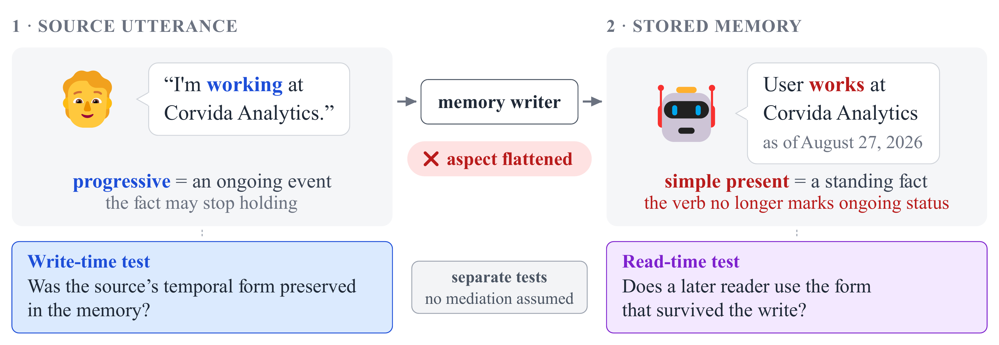
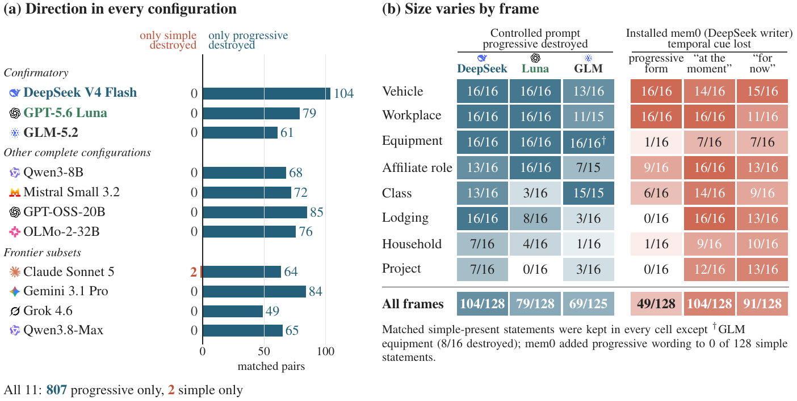

# LAPSE: aspectual flattening in LLM memory consolidation

Code, data, model outputs, and labels for the submission *Language Model
Memory Flattens the Temporal Form of User Facts*. This copy is
anonymized for review.

A user says "I am driving a Peugeot." The memory writer stores "The user drives
a Peugeot." The progressive told a later reader the fact might not last; the
stored note asserts it as a standing fact. LAPSE (Linguistic Aspect Persistence
and Stability Evaluation) measures this with matched user statements that
differ only in temporal form.

On the three confirmatory writers, the progressive was flattened while its
simple-present match was kept in 244 of 381 matched pairs, and never the
reverse (DeepSeek V4 Flash 104/0 of 128, GPT-5.6 Luna 79/0 of 128, GLM-5.2
61/0 of 125). The installed mem0, Graphiti, and Letta pipelines flatten too.

<p align="center">
  
</p>

<p align="center">
  
</p>

## Contents

```
data/          LAPSE stimuli (5,916 rows: 4,791 dev, 1,125 test), build manifests,
               scorer-validation gold sets, witness contamination checks
tools/         stimulus builder, model runner, rule-based scorer, judge,
               confirmatory and secondary analyses (see tools/README.md)
tests/         scorer regressions and stimulus audits
traces/        11 model columns: raw outputs, scored labels, judge labels
results/       frozen analysis outputs the paper reports
exploratory/   follow-up experiments: installed pipelines, reader tasks,
               verification tool, qualifier ablation, reanalyses
MANIFEST.sha256  SHA-256 of every data file, results file, and script
```

## Install

Python 3.10 or newer. The scorer and analyses use only the standard library;
`openai` is needed to query models and `pytest` to run the tests.

Download the repository, unpack it, and run the commands below from its root:

```bash
python3 -m venv .venv && source .venv/bin/activate
pip install -r requirements.txt
```

The follow-up experiments under `exploratory/` have their own dependencies
(mem0, graphiti-core, letta, scipy); their scripts name them at the top.

## Reproduce the paper's numbers

No model calls. Each command prints nothing on success except the test count:

```bash
python3 tools/analysis_v2.py | cmp - results/ANALYSIS_V2_2026-08-27.txt
python3 tools/analysis_v2_secondary.py | cmp - results/ANALYSIS_V2_SECONDARY_2026-08-27.txt
python3 -m pytest -q tests                 # 85 passed
shasum -a 256 -c --quiet MANIFEST.sha256
```

## Use the stimuli

`data/stimuli_v2.jsonl` holds the 5,916 LAPSE items, one model call per line
("v2" is an internal build number). Each item is a dated conversation
(`history`) and a request (`query`). Put the history into the system prompt
from `data/manifest_v2.json` and send the request as the user turn:

```python
import json

manifest = json.load(open("data/manifest_v2.json"))
items = [json.loads(line) for line in open("data/stimuli_v2.jsonl")]

# The main test: memory-write items, progressive vs simple present, months old.
main_test = [r for r in items if r["component"] == "e1_primary"]

item = main_test[0]
messages = [
    {"role": "system", "content": manifest["system_template"].format(history=item["history"])},
    {"role": "user", "content": item["query"]},
]
```

Two fields say what an item tests. `arm` is the task, named as in the paper:

| `arm` | Task in the paper | The model is asked to |
|---|---|---|
| `e1` | memory write | write memory notes about the conversation |
| `l2` | guided memory write | write notes, told to keep tense and aspect |
| `behavioral` | direct use | act on the user's fact |
| `explicit` | validity question | say whether the fact still holds |
| `anchor` | send-or-check choice | send now or check with the user first |

Memory-write items also get a second call at run time, built from the model's
own notes: `e2` (memory use) and `l2e2` (guided memory use). These are not
rows in the file.

`component` is the design cell:

| `component` | Task | What the cell varies |
|---|---|---|
| `e1_primary` | memory write | **main test**: progressive vs simple present, statement months old |
| `e1_boundary` | memory write | the same pairs, dated at the boundary gap (see `gap`) |
| `e1_fresh_gate` | memory write | simple present stated just before; the writer should keep it |
| `carrier_e1` | memory write | the main-test pairs in five other sentence frames (`carrier`) |
| `l2` | guided memory write | the main-test pairs |
| `explicit` | validity question | progressive vs simple present, months old |
| `behavioral_core` | direct use | progressive, simple present, and bounded statements; fresh and months old |
| `behavioral_boundary` | direct use | the same, at the boundary gap |
| `carrier_behavioral_p2`, `carrier_fresh_p3` | direct use | five other sentence frames; months old / fresh simple present |
| `anchor` | send-or-check choice | the `behavioral_core` design |
| `gap_gradient` | direct use | three more gaps: near, just expired, over a year |
| `perf` | memory write, direct use | perfect forms ("I've been living") |
| `lexeme_subject` | memory write | different verbs across a pair; third-person subjects |
| `v1_grid_extra` | none | not run; kept so the tests can compare with the earlier build. Skip these. |

`tier` marks how the paper uses a row: `CONF` confirmatory, `SEC` secondary,
`EXP` exploratory. The other fields are described in `data/README.md`.

## Evaluate a new model

The committed stimuli are dated for an evaluation on 2026-08-11. A new run
should rebuild them for the day it runs, so that "today" in the system prompt
matches the session dates. The builder writes into `data/` next to `tools/`,
so work in a copy of `tools/` and keep the reference build intact:

```bash
mkdir -p ~/lapse-run && cp -r tools ~/lapse-run/ && cd ~/lapse-run

# 1. Build stimuli dated today (5,916 rows, deterministic).
python3 tools/build_stimuli_v2.py --eval-date $(date +%F)

# 2. Check the call count (and, on OpenRouter, the projected cost).
python3 tools/run_pilot_v2.py --stimuli data/stimuli_v2.jsonl \
    --manifest data/manifest_v2.json --models <model-id> --dry

# 3. Run. --smoke sends a 289-call dev subset; --full sends all 6,008 calls
#    and requires --i-have-user-approval as a guard against accidental spend.
export OPENROUTER_API_KEY=...
python3 tools/run_pilot_v2.py --stimuli data/stimuli_v2.jsonl \
    --manifest data/manifest_v2.json --models <model-id> \
    --full --i-have-user-approval          # writes traces/run-v2-full-<time>.jsonl

# 4. Score, then report the paper's per-model statistics.
python3 tools/score.py traces/run-v2-full-<time>.jsonl     # writes .scored.jsonl
python3 tools/evaluate.py traces/run-v2-full-<time>.scored.jsonl
```

For a local OpenAI-compatible server (for example `vllm serve`), add
`--base-url http://localhost:8000/v1`; set `LOCAL_API_KEY` if the server
needs one, and add `--disable-thinking` for Qwen3-style chat templates. A run
that stops partway resumes with `--resume traces/<run>.jsonl`.

The first line of `evaluate.py` output is the main result: how many matched
progressive/simple pairs had only the progressive note flattened (`b`) versus
only the simple one (`c`). `score.py` also lists responses its rules could not
label (`RESIDUAL`); these are excluded from the tests. The paper adds a
second, model-based detector (`tools/judge.py`); it is optional for a new
model.

Rerunning a paper model is not expected to reproduce byte-identical
responses. Rescoring a committed raw trace with `tools/score.py` reproduces
the committed `.scored.jsonl` exactly.

## Model columns

| Tier | Model | Rows |
|---|---|---|
| Confirmatory | deepseek/deepseek-v4-flash, openai/gpt-5.6-luna, z-ai/glm-5.2 | 6,008 calls each |
| Open weights | Qwen3-8B, Mistral Small 3.2 24B | 6,008 calls each |
| Extension (estimation only) | gpt-oss-20b, OLMo-2-32B-Instruct | 6,008 calls each |
| Frontier subset | Claude Sonnet 5, Gemini 3.1 Pro, Grok 4.6, Qwen3.8-Max | 736 calls each |

All runs used temperature 0 and the frozen generator v2.0.1.

## Not included

- The sealed answer key for the 250-item human gold sample
  (`data/gold_key_v1.json`). `tools/gold_agreement.py` needs it to recompute
  human-scorer agreement.
- WildChat, LoCoMo, and LongMemEval excerpts used in the natural-text screens
  and the real-utterance writer test. See `DATA_LICENSES.md`.

## Citation

Withheld during anonymous review.
